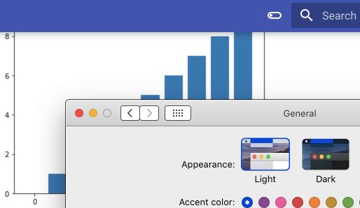
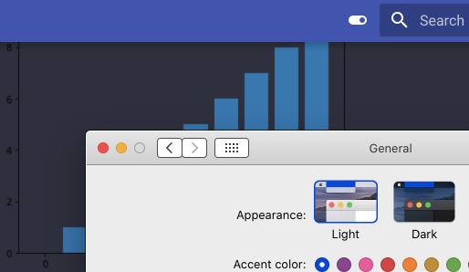
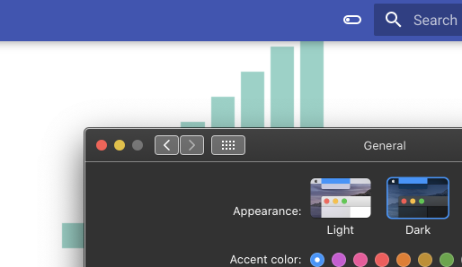
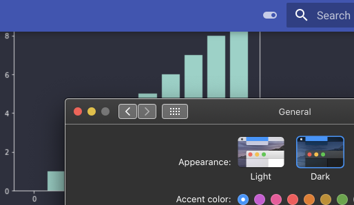

# Illustration of theme/scheme disconnect in [squidfunk/mkdocs-material#2727](https://github.com/squidfunk/mkdocs-material/issues/2727)

## Setup

Consider this …

```html
<picture>
  <source srcset="dark.png" media="(prefers-color-scheme: dark)" />
  
</picture>
```

… which renders as:

<picture>
  <source srcset="dark.png" media="(prefers-color-scheme: dark)" />
  
</picture>

## Expected behavior

From [the docs](https://squidfunk.github.io/mkdocs-material/setup/changing-the-colors/#system-preference):

> In order to automatically set the color palette to the user's system preference, a media query can be set as part of the `media` field next to the toggle definition in `mkdocs.yml`:
>
> ``` yaml hl_lines="3 8"
> theme:
>   palette:
>     - media: "(prefers-color-scheme: light)"
>       scheme: default
>       toggle:
>         icon: material/toggle-switch-off-outline
>         name: Switch to dark mode
>     - media: "(prefers-color-scheme: dark)"
>       scheme: slate
>       toggle:
>         icon: material/toggle-switch
>         name: Switch to light mode
> ```
>
> When the user first visits your site, the media queries are evaluated in the order of their definition.
> The first media query that matches selects the default color palette.

After reading the above, as well as [squidfunk/mkdocs-material#1266](https://github.com/squidfunk/mkdocs-material/issues/1266), my understanding is:

1. Toggling the theme using the toggle switch will switch the preferred color scheme; and
1. Switching the preferred color scheme will toggle the theme.

However, they are disconnected as far as I can tell.

## Observed behavior

1. Toggling the theme using the switch in the header of this page will update the theme, but not the scheme.
1. Toggling the preferred color scheme (e.g., on MacOS, switching from `Light` to `Dark` in `System Preferences` » `General` » `Appearance`) will update the scheme, but not the theme.

## Detail

Test matrix:

| Theme&nbsp;👉<br />Scheme&nbsp;👇 | Light | Dark  |
| --------: | :---: | :---: |
| **Light** |  |  |
| **Dark**  |    |    |

Tested with:

| package                    | version |
| :------------------------- | ------: |
| mkdocs                     | 1.1.2   |
| mkdocs-material            | 7.1.6   |
| mkdocs-material-extensions | 1.0.1   |

## Work-around using `extra_css` to tie image selection to user-selected theme

Consider this …

```css
/* docs/image_theme.css */
img.dark { display: none; }
img.light { display: unset; }
[data-md-color-scheme="slate"] img.dark { display: unset; }
[data-md-color-scheme="slate"] img.light { display: none; }
```

```yaml
# mkdocs.yml
# …
extra_css:
  - image_theme.css
# …
theme:
  name: "material"
  # …
  palette:
    - scheme: default
      media: "(prefers-color-scheme: light)"
      toggle:
        icon: material/toggle-switch-off-outline
        name: Switch to dark mode
    - scheme: slate
      media: "(prefers-color-scheme: dark)"
      toggle:
        icon: material/toggle-switch
        name: Switch to light mode
# …
```

```html

```

… which renders as:


This leverages the [custom color scheme overrides](https://squidfunk.github.io/mkdocs-material/setup/changing-the-colors/#custom-color-schemes) mechanism to tie image presentation to the chosen theme, which gets close to the desired behavior.

### Pros

* It preserves the existing theme toggle behavior.
* It’s a pretty minimal intrusion (four lines of CSS and use of the [`extra_css` setting](https://www.mkdocs.org/user-guide/configuration/#extra_css)).
* It’s pretty readable.
  If you were ignorant (or forgetful) of the approach, and came across one of the ``s, you probably wouldn’t have to do too much digging to find out what was going on.

### Cons

* It’s bespoke.
* It’s pretty fragile.
  The CSS selectors are tied to the theme names.
  One could probably work around this as well, but they probably add a disproportionate amount of complexity for their value.
* All image variants are retrieved on page load, even those that won’t be displayed until a theme change (which is probably a rare event).
  This isn’t ideal, and gets worse as the number of theme-specific image variants increases.

## Work-around using `extra_javascript` to tie theme selection to `prefers-color-scheme`

Consider this …

```javascript
// docs/image_theme.js
const mediaQueryList = window.matchMedia("(prefers-color-scheme: dark)");

function handleColorSchemeChange(event) {
  var body = document.querySelector("body[data-md-color-scheme]");
  var theme;
  if (event.matches) {
    theme = "slate";
  } else {
    theme = "default";
  }
  if (body !== null && theme !== null) {
    body.setAttribute("data-md-color-scheme", theme);
  }
}

handleColorSchemeChange(mediaQueryList);
mediaQueryList.addListener(handleColorSchemeChange);
```

```yaml
# mkdocs.yml
# …
extra_javascript:
  - image_theme.js
# …
theme:
  name: "material"
  # …
  palette:
    # Note: toggle sections have been removed
    - scheme: default
      media: "(prefers-color-scheme: light)"
    - scheme: slate
      media: "(prefers-color-scheme: dark)"
# …
```

… and let’s revisit this (from above) …

```html
<picture>
  <source srcset="dark.png" media="(prefers-color-scheme: dark)" />
  
</picture>
```

… which would render¹ as:

<div id="emulated">
  <picture>
    <source srcset="dark.png" media="(prefers-color-scheme: dark)" />
    
  </picture>
</div>

!!! note
    ¹ This is emulated here using `image_theme_emulated.js` in lieu of `image_theme.js`.
    This is to preserve the aforementioned disconnected behavior for observation/experimentation.

This adapts [this approach](https://developer.mozilla.org/en-US/docs/Web/CSS/Media_Queries/Testing_media_queries#receiving_query_notifications) to tie theme selection to the chosen `prefers-color-scheme`, which emulates the desired behavior.

### Pros

* It’s a pretty minimal intrusion (some straightforward JavaScript, and use of the [`extra_javascript` setting](https://www.mkdocs.org/user-guide/configuration/#extra_javascript)).
* It works with existing standard approaches like the `<picture>

### Cons

* It fights with the user selected theme toggle.
  Consider disabling it by deleting any `theme` » `palette` » `toggle` settings.
* It’s still pretty fragile.
  The JavaScript is tied to the theme names.
